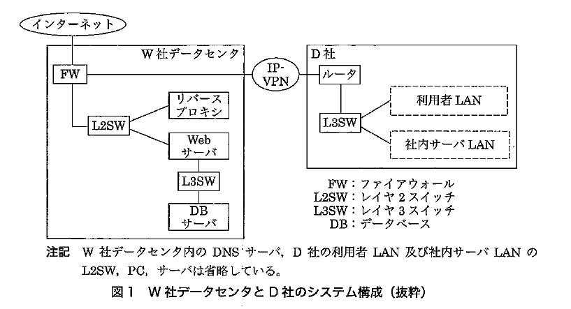
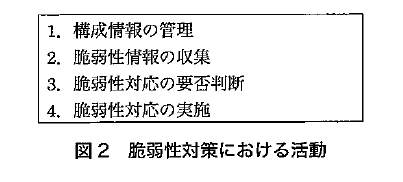
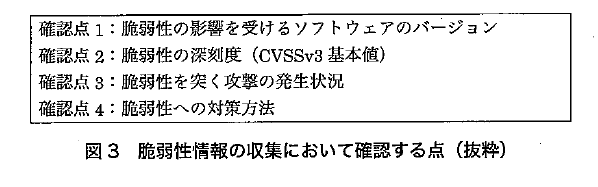
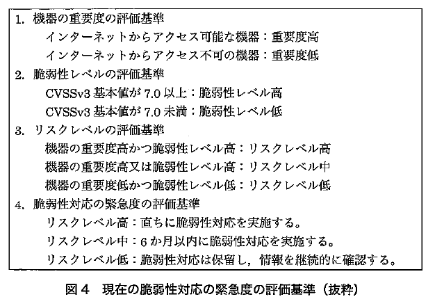

# R3春期課外授業　応用情報対策

### 問1　情報セキュリティ　webサイトの脆弱性対策

D-Webサイト
- 利用者ブラウザとリバースプロキシ間はHTTPSによって通信する
- リバースプロキシとwebサーバ間はHTTPで通信
- リバースプロキシがTLSサーバとして動作する

〔E社のインシデント〕
- ミドルウェアの脆弱性をついた攻撃を受けた
- 対応のため2ヵ月webサイトを閉鎖した
- 原因となった脆弱性は、攻撃が成功した場合にwebサイトの利用者のブラウザ上で攻撃用のスクリプトが実行される〔a〕に対するもの
- 構成情報の管理が不十分だったため、一部のサーバに脆弱性修正プログラムが適用されていなかったことが原因

〔E社のインシデントからD社の脆弱性対策〕
- 構成情報の管理では、サーバごとにインストールされているソフトウェアの名称とバージョン、ベンダあるいは開発コミュニティ名、連絡先、変更履歴などについて構成管理システムを用いて管理している
- 脆弱性情報の収集では、最新バージョンの提供サイトや、脆弱性関連情報データベース、ニュースサイト、注意喚起サイト、製品ベンダサイトから収集している

- 収集する情報にD社では使用していないソフトウェアの情報も含まれるため見直しが必要

> 設問1

本文中の〔a〕に入れる適切な字句を解答群の中から選び，記号で答えよ。
    
    「webサイトの利用者のブラウザ上で攻撃用のスクリプトが実行される」という特徴を持つ攻撃はクロスサイトスクリプティングなので、アが正解

    イ：偽装HTTPリクエストを送る攻撃
    ウ：攻撃者の種類の一つ。技術力の低いクラッカー
    エ：アクセスを意図していないディレクトリに不正アクセスされる攻撃

> 設問2　構成情報の管理及び脆弱性情報の収集に関する問題

(1)本文中の下線①について， E社で発生したような問題の発生を防ぐことができる理由を25字以内で述べよ。
    
    「この構成情報を活用することによって　、E社で発生したような問題を防ぐとともに、脆弱性対応を迅速に行える」

    E社でインシデントが発生した理由のひとつに「構成情報の管理が不十分だったため、一部のサーバに脆弱性修正プログラムが適用されていなかったことが原因」
    とある。つまり脆弱性修正プログラムが適用する必要があるサーバに漏れがあったということになる。

    しかし、D社ではサーバごとにインストールされているソフトウェアの名称、バージョンを管理しているため、適用対象のサーバに漏れがなく、E社のようなイン
    シデントの発生を防ぐことができる

    といった内容が書ければOK！

(2)本文中の下線②について，適切な改善案を解答群から選び，記号で答えよ。
    
    情報システム部のメンバから，“収集する情報にD社では使用していないソフトウェアの惜報も含まれているので見直しが必要である”という意見が出された。
    K主任は，②脆弱性情報の収集に関する改善案を提案することにした。

    つまり、必要の無い情報の収集をやめ、適切な情報を収集できるようにする必要がある
    解答群のから上記のような改善をしているもの探すとウの「脆弱性情報提供サイトから，俯報を自動的に収集するツールを利用する。」が適切であると判断できる

    ア：エクスプロイコードの公開の有無は、対応の緊急性の判断に影響する。しかし、今回の不要な情報の収集をしているという問題には関係がない
    イ：その通りではあるが、回の不要な情報の収集をしているという問題には関係がない
    ウ：自動情報収集ツールは、登録した構成情報を基づいて必要な情報を収集するツール
    エ：開発コミュニティからの情報収集は構成情報の管理で既に収集している

> 設問3
    
本文中の〔b〕,〔c〕に入れる適切な字句を答えよ。

    設問3は図4からリスクレベルを求めることになる
    〔bの解説〕
    webサーバで動作しているソフトウェアのリスクレベルを求める

    項目1　インターネットからのアクセスの有無　→　アクセス可能　→　重要度高
    項目2　CVSSv3基準値が7.0以上or未満　→　CVSSv3基準値7.0　→　脆弱性レベル高
    
    重要度高、脆弱性レベル高　→　リスクレベル高

    〔cの解説〕
    DBサーバで動作しているソフトウェアのリスクレベルを求める

    項目1　インターネットからのアクセスの有無　→　アクセス不可　→　重要度低
    項目2　CVSSv3基準値が7.0以上or未満　→　CVSSv3基準値9.0　→　脆弱性レベル高
    
    重要度低、脆弱性レベル高　→　リスクレベル中

    CVSS・・・情報システムの脆弱性に対するオープンで汎用的な評価手法

> 設問4

〔脆弱性対応の実施〕について，(1)~(4)に答えよ。
(1)本文中の下線③について，脆弱性修正プログラムを適用する際の作業内容として，適切なものを解答群から選び，記号で答えよ。

    「脆弱性対応は，計画の策定，事前の準備，対応の実施という手順で実施している。」

    ア：〔構成備報の管理及び脆弱I生情報の収集〕に「構成情報の管理では、サーバごとにインストールされているソフトウェアの名称とバージョン、ベンダあるい
    は開発コミュニティ名、連絡先、変更履歴などについて構成管理システムを用いて管理している」と記述されている。そのため、脆弱性修正プログラムの適用につ
    いては、ソフトウェアの変更履歴として記録する必要があるので、構成管理システムで管理している構成情報を更新することは作業内容として適切である。

    イ：通常の脆弱性修正プログラムの適用の際には、サーバのOSを再インストールする必要はないので、適切とはいえない。

    ウ：ディジタルフォレンジックスとは、セキュリティインシデント対応において、証拠保全や原因分析のためにデータの保存や分析を行う活動である。
    そのため、ディジタルフォレンジックスのために、適用先のストレージを複製することは適切とはいえない。なお、脆弱性修正プログラムを適用する場合には、
    事前にデータのバックアップを取得しておくことは必要である。

    工：脆弱性修正プログラムを適用する際には、適用に伴うトラブルを防ぐために、試験環境において動作確認などの事前検証を十分に行うことが重要である。
    そのため、リスクレベル高の脆弱性への対応であっても、事前検証を省略することは適切とはいえない。
    
    以上から、（ア）が適切である。

(2) 本文中の〔d〕に入れる適切な字句を解答群の中から選び、記号で答えよ。

    EとKの会話の中で「D—Webサイトにおいて対応が必要になる脆弱性は、Webサーバで動作するソフトウェアが大部分で、Webアプリケーションの動作に関わる
    ものが多い」という部分がある。

    この会話から〔d〕に入る語句がD-Webサイトの脆弱性がWebアプリケーションの動作に関わるものが多いことを踏まえるとWebアプリケーションの脆弱性を突く
    攻撃に関する物が適切であると判断できる

    ア：キャッシュポイズニングの対策
    イ：ログデータを管理し、攻撃や不正な動作を検知するシステム
    ウ：鍵作成や暗号処理などの機能をもつセキュリティチップ

(3) 本文中の〔e〕に入れる適切な字句を本文中又は図中から選び、10字以内で答えよ。

    「WAFについては，既に情報を収集しています。対応に問題があった3件について確認したところ，ベンダからは脆弱性に対応したシグネチャが直ちに
    提供されていたので,〔e〕に従った対応実施が可能だったと考えられます。」

    提供されたシグネチャを基に対応に問題があった脆弱性に対応することができたということ

    会話で挙げられている3件の問題はリスクレベル高に該当し、緊急度の評価基準に照らし合わせると”直ちに対応を実施する”が該当することになる。

    つまり、WAFを利用していれば提供されているシグネチャを基に緊急度の評価基準に従った”直ちに対応を実施する”が可能であったということになる。

    このことから、eに入る言葉は「緊急度の評価基準」が適切と言える

    シグネチャ・・・コンピュータウイルスなどに含まれる特徴的なデータ断片や、攻撃者のアクセスに特徴的な受信データのパターンなど

    WAFにおけるシグネチャ・・・Webアプリケーションヘの攻撃を検知するために用いられる攻撃のパターンやルールを定義した情報の事である

(4)本文中の〔f〕、〔g〕に入れる適切な字句を図l中から選んで答えよ。ただし、”L2SW”及び”L3SW” は除くこと。

    「W社データセンタ内にWAFを設置する場合、〔f〕から〔g〕への通信を監視して攻撃を遮断することになる。具体的な製品やサービスを調査してほしい。」

    WAFはwebサーバへアクセスするHTTPメッセージを監視する。

    今回の構成ではwebサーバにアクセスするにはリバースプロキシを経由してアクセスすることになる
    インターネットとリバースプロキシはHTTPSで暗号化されているが、リバースプロキシからwebサーバの通信はHTTPになっている
    したがって、WAFで監視すべき通信はリバースプロキシからwebサーバへのHTTP通信となる

    〔f〕　リバースプロキシ
    〔g〕　webサーバ
